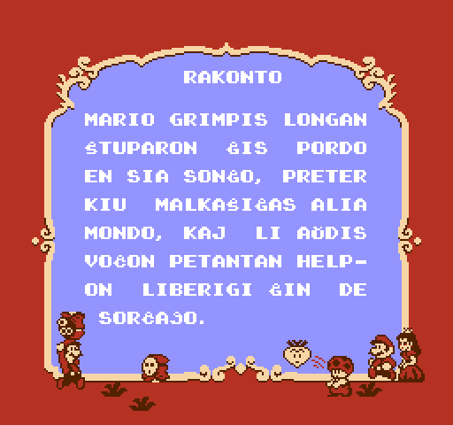

# Super Mario Bros 2

_Legu
[supermariobros2-readme.txt](supermariobros2-readme.txt)
por esperanta priskrbo._

This project is a fan translation of
[Super Mario Bros 2](https://en.wikipedia.org/wiki/Super_Mario_Bros._2),
a video game for the Nintendo Entertainment System, to Esperanto. All
copyrights on the original game belong to Nintendo.

You *must* own a physical copy of the Super Mario Bros 2 cartridge. Downloading
the ROM of any game which you do not own may be considered piracy.

  * Super Mario Bros 2 - CRC32 `7D3F6F3D`

## Screenshots

Here are some pretty screenshots:

